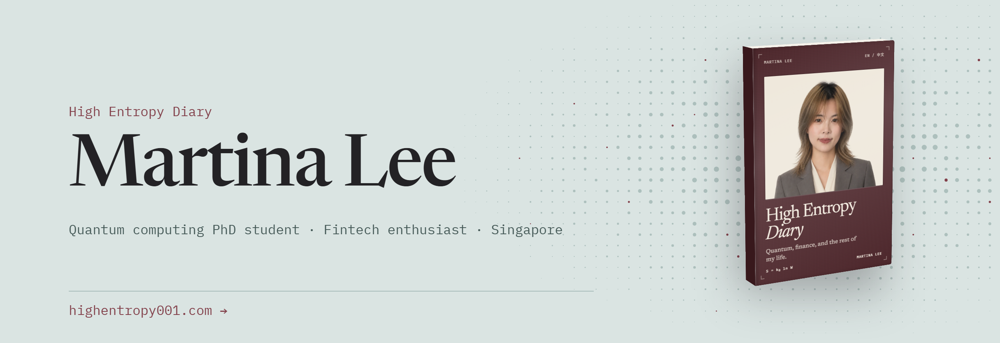

<a href="https://highentropy001.com">
  <picture>
    <source media="(prefers-color-scheme: dark)" srcset="assets/banner-dark.png" />
    
  </picture>
</a>

  <a href="https://highentropy001.com">Website</a> ·
  <a href="https://www.linkedin.com/in/martina-lee-zy/">LinkedIn</a>

Most days I’m on Singapore’s first homegrown superconducting quantum computer, a 20-qubit processor at NTU and the [Centre for Quantum Technologies](https://www.cqt.sg/). I’m using machine-learning methods to improve qubit readout fidelity, and picking up the FPGA control stack.

I’ve been into crypto since 2019, way before I studied physics. I like zero-knowledge proofs, options and trading, so I tend to build around markets and privacy.

### Things I’ve built

- [**Separatrix**](https://highentropy001.com/projects/separatrix/) Sep 2026 · solo Quantum-inspired optimisation everyone can check: a Rust simulated-bifurcation solver raced against the exact optimum in your browser.
- [**Anneal**](https://highentropy001.com/projects/anneal/) Mar–May 2026 An options DEX on Solana, built as a private OTC market: traders get competing quotes without revealing their budget.
- [**CrowdShift**](https://highentropy001.com/projects/crowdshift/) Jul 2026 · solo A market that pays commuters to miss the crush: shift your trip off-peak and get paid once the shift is verified.
- [**Soliton**](https://highentropy001.com/projects/soliton/) Jun 2026 · solo Verifiable memory for AI agents: each write gets a receipt on Sui, while the content is stored on Walrus.
- [**Agent Auction Protocol**](https://highentropy001.com/projects/agent-auction-protocol/) Mar 2026 Private auctions for autonomous AI agents: a computing-resources marketplace with verifiable settlement.
- [**Superconducting qubits from scratch**](https://highentropy001.com/research/superconducting-qubits/) Jun 2026 · open course Twelve chapters and twelve QuTiP labs I compiled after teaching PH3410 Quantum Hardware.

[All projects, demos and awards →](https://highentropy001.com/projects/)

### Latest from the High Entropy Diary

<!-- BLOG-POST-LIST:START -->
- [My final-year project: steering a UV laser for trapped ions](https://highentropy001.com/posts/final-year-project-trapped-ion-laser/) 26 Sep 2026
- [Nine minutes to a private key, read from a qubit lab](https://highentropy001.com/posts/quantum-attack-from-the-bench/) 24 Apr 2026
- [A proof can verify and still be wrong](https://highentropy001.com/posts/a-proof-can-verify-and-still-be-wrong/) 29 Mar 2026
- [Inside a modern prover: sumcheck, lookups and Binius](https://highentropy001.com/posts/inside-a-modern-prover/) 16 Mar 2025
- [Is a qubit better than a bit at everything?](https://highentropy001.com/posts/summer-at-cqt-quantum-cryptography/) 17 Mar 2024
<!-- BLOG-POST-LIST:END -->

[All posts →](https://highentropy001.com/posts/) · [RSS](https://highentropy001.com/rss.xml)
